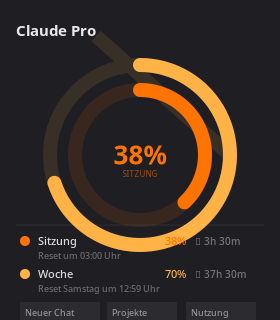

# Claude Usage Widget

A KDE Plasma 6 widget for Arch Linux that shows your **Claude Pro session and weekly usage** at a glance — directly in your panel or on your desktop.



## Features

- **Compact panel view** — two concentric ring arcs showing session (5h window) and weekly usage, plus time until next reset
- **Full desktop/popup view** — detailed rings, legend with exact percentages and reset times, quick-access buttons
- **Quick links** — New Chat, Projects, Usage page on claude.ai
- **App shortcuts** — open Claude CLI in your terminal or reopen VS Code
- **Auto-refresh** — configurable interval (default: 5 minutes)
- **Configurable** — background opacity, terminal app, refresh interval

## Requirements

- KDE Plasma 6
- Python 3
- A Claude Pro account with an active session cookie

## Installation

```bash
git clone https://github.com/GitGoodFabi/claude-arch-widget.git
cd claude-arch-widget
bash setup.sh
```

`setup.sh` will:
1. Ask for your `sessionKey` cookie value and store it securely at `~/.config/claude-widget/session.txt` (chmod 600)
2. Test the data fetch
3. Install the Plasma widget

Then: right-click your desktop or panel → **Add Widgets** → search for **Claude Usage**.

## Getting your session key

1. Open [claude.ai](https://claude.ai) in your browser
2. Open DevTools (`F12`) → **Application** → **Cookies** → `https://claude.ai`
3. Copy the value of the `sessionKey` cookie
4. Paste it when `setup.sh` asks

> The session key is stored only on your machine and never leaves it. It is not included in this repository.

## Configuration

Right-click the widget → **Configure**:

| Option | Default | Description |
|---|---|---|
| Background opacity | 0% | Transparency of the dark background panel |
| Terminal app | `konsole` | Used for the "Claude CLI" button (e.g. `kitty`, `alacritty`) |
| Auto-refresh | 5 min | How often usage data is fetched |

## How it works

`claude_usage.py` authenticates against the claude.ai API using your session cookie and fetches usage data from `/api/organizations/{id}/usage`. The widget calls this script on a timer and parses the JSON output.

## License

MIT
